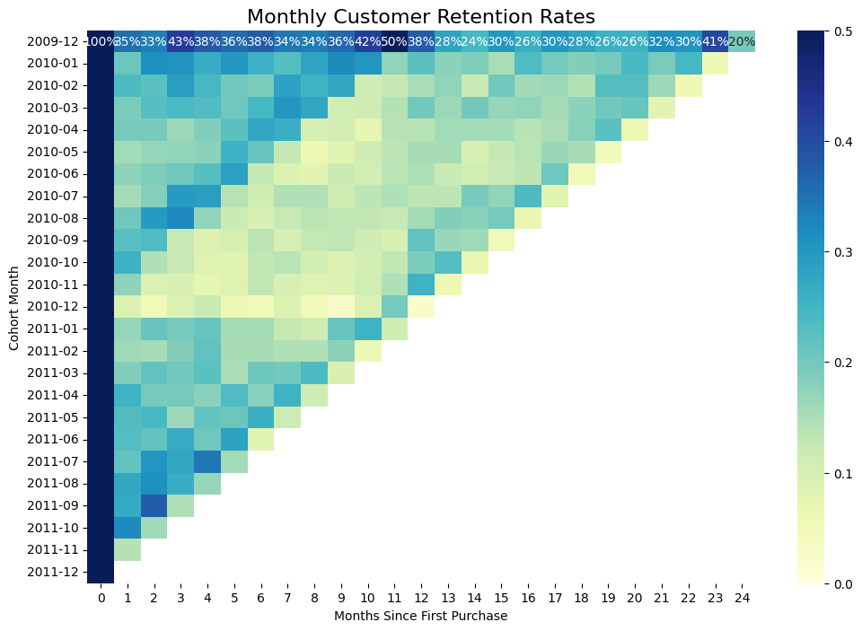

# 💰 Customer Retention Leakage Analysis: Quantifying 65% Month-One Churn

## 🎯 Project Status & Executive Summary

| Status | Domain Focus | Primary Technique | Deliverable |
| :--- | :--- | :--- | :--- |
| **Completed** | E-commerce / Product Strategy | **Cohort Analysis** using Advanced SQL (CTEs) | Strategic Recommendation to stabilize LTV. |

**Executive Summary:**
This project leveraged **SQL-based Cohort Analysis** on a transactional dataset (805K cleaned records) to isolate the precise point of customer churn. Analysis revealed a **critical 55%–65% customer leakage (churn) between the first and second month (M0 to M1)** across all cohorts. The analysis shifts focus from generic acquisition efforts to targeted **Day 7/Day 10 onboarding interventions** to increase customer lifetime value (LTV).

---

## 💡 Business Problem & Objective

The primary challenge was the unacceptably low initial retention rate post-purchase, indicating a breakdown in the customer journey that was undermining high acquisition spend.

* **Problem:** Identify the specific time window where the largest segment of paying customers is lost.
* **Objective:** Quantify the retention percentage for each cohort over a 12-month period and propose a measurable, data-driven strategy to lift the retention curve.

---

## 🛠️ Technical Pipeline & Stack

The analysis follows a standard ETL-Analysis-Visualization pipeline, relying heavily on SQL for complex aggregation.

| Phase | Tool | Key Technique | File Reference |
| :--- | :--- | :--- | :--- |
| **Data Preparation (ETL)** | Python (Pandas) | Data Cleansing (handling missing Customer IDs, removing cancellations), Date-time conversion. | `01_Data_Prep.ipynb` |
| **Analytical Modeling** | **SQL (SQLite)** | **Common Table Expressions (CTEs)** and **Date Functions** to define Cohort Month and calculate Month Index. | `02_SQL_Analysis.ipynb` |
| **Visualization** | Python (Seaborn, Matplotlib) | Creation of the **Retention Heatmap** and percentage formatting for clarity. | `03_Visualization.ipynb` |

### **Key Metrics Defined:**
* **Cohort Month:** The month of a customer's very first purchase (e.g., Dec 2009).
* **Month Index:** The difference in months between the current transaction and the Cohort Month (Index 0 = Start Month).
* **Retention Rate:** The percentage of customers from the original cohort who remain active (purchased at least once) in any given subsequent month.

---

## 📊 Key Findings & Strategic Recommendation

The generated Retention Heatmap (Figure 1) clearly visualizes the leakage point.

### **Key Finding: The 65% Drop-Off**
Retention for the majority of cohorts drops from 100% at **Month Index 0** to approximately **35-47% at Month Index 1** (depending on the cohort). This immediate, non-linear failure rate is the most critical area for the business to address. The long-term retention rate (Months 3-12) is stable, suggesting the product is good, but the **onboarding experience is failing.**

### **Strategic Recommendation**
Based on the data showing peak failure between M0 and M1:
* **Focus:** Shift resource allocation from generic acquisition marketing to a dedicated **Customer Success/Onboarding team.**
* **Action:** Implement an automated, mandatory **feature education sequence** or a Day 7 personalized incentive (e.g., 10% off the next purchase) aimed specifically at users who have only made one transaction.
* **Expected Impact:** Stabilizing the M1 retention rate by **10 percentage points** would lead to a significant, quantifiable increase in Customer Lifetime Value (LTV).

---

## 📁 Repository Structure

* `01_Raw_Data/`: Contains the original `retail_transactions_raw.csv`.
* `02_Processed_Data/`: Contains the cleaned data and intermediate analytical results (e.g., `cohort_retention_data.csv`).
* `03_SQL_Scripts/`: SQL queries used for the cohort model.
* `04_Python_Notebooks/`: All exploratory and visualization notebooks (`01_Data_Prep.ipynb`, etc.).
* `05_Insights_Reports/`: Final visualization output (`retention_heatmap.png`).